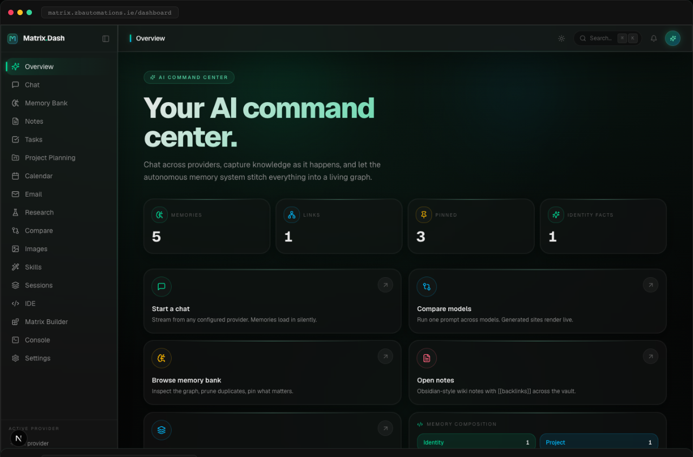
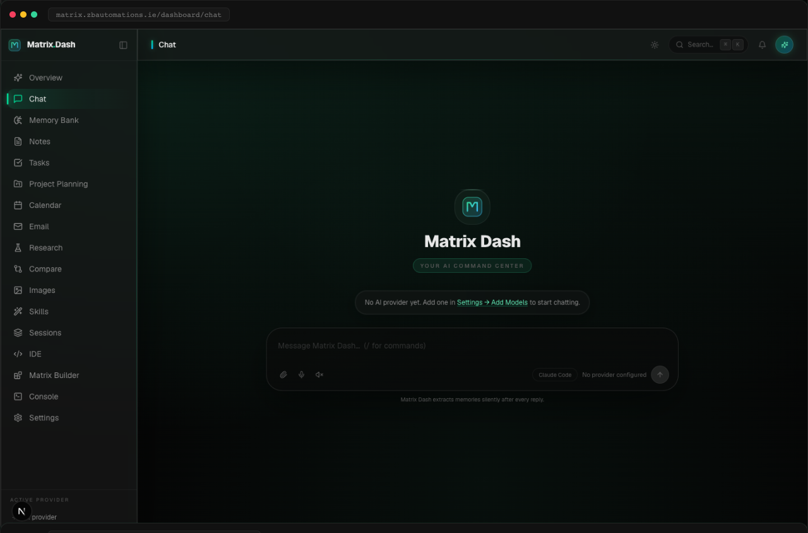
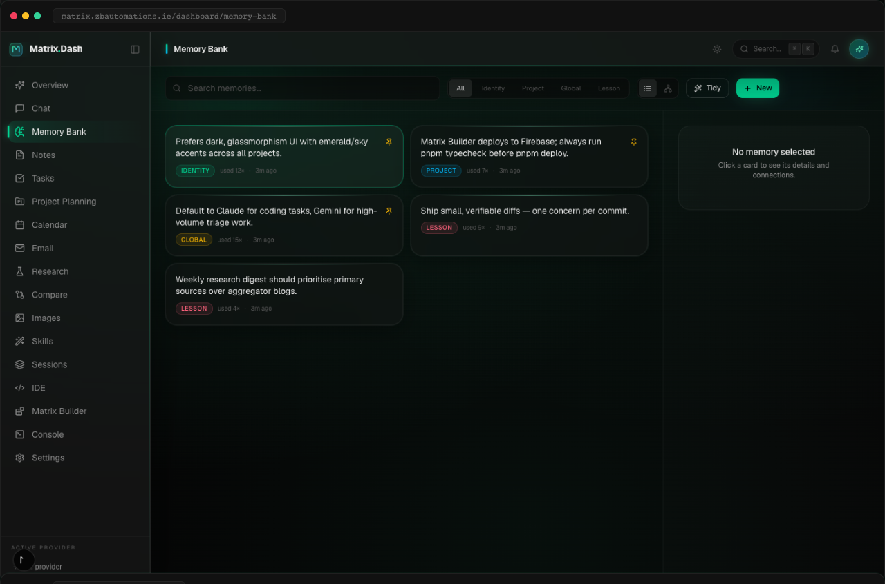

<div align="center">

# Matrix Dashboard

**A local-first AI command center — your own private "Jarvis."**
Chat across 20+ providers, run a real on-disk IDE, manage skills, schedule tasks, triage email, and run local models through Ollama — all on your machine, with API keys encrypted at rest.

[](https://nextjs.org)
[](https://www.typescriptlang.org)
[](https://github.com/WiseLibs/better-sqlite3)
[](https://tailwindcss.com)
[](https://matrix.zbautomations.ie)

</div>

---

## Table of Contents

- [Screenshots](#screenshots)
- [Highlights](#highlights)
- [Security model](#security-model)
- [Getting started](#getting-started)
- [Credits & acknowledgements](#credits--acknowledgements)

---

## Screenshots

<p align="center">
  
</p>
<p align="center">
  
  
</p>

---

## Highlights

- **Multi-provider chat** with live token streaming and a collapsible *thinking* trace for reasoning models (Anthropic extended thinking).
- **20+ AI providers** out of the box — Anthropic, OpenAI, Google, Mistral, xAI, DeepSeek, Groq, OpenRouter, Together, Fireworks, Perplexity, Cohere, Ollama, LM Studio, and more — with pre-filled base URLs and default models.
- **Real workspace IDE** — open an actual project folder from disk, browse a live file tree, edit in Monaco, and save straight back to disk (no virtual files). Full error surfacing via toasts.
- **Skills** — author your own, or **bulk-import from any GitHub repo** of `SKILL.md` files in one click.
- **16 named themes + a full theme studio** — color pickers, a color-harmony generator, font/density controls, frosted-glass toggle, and import/export.
- **Cookbook** — hardware-aware local model management via Ollama: a ~34-model catalogue with **FIT** badges and scoring against your detected VRAM, server start/stop/restart, loaded-model view, dependency probing, and runtime config.
- **Pretty server logs** — colorized `METHOD /path → STATUS (ms)` request logging.
- Plus: tasks + scheduler daemon, notes graph, email (IMAP/SMTP + AI triage), calendar (CalDAV), vector RAG over uploads, deep research, provider compare, PWA, 2FA, API tokens, webhooks, and backups.

## Security model

- API keys and passwords are **AES-256-GCM encrypted** at rest. The encryption key lives at `~/MatrixDash/.key` (file mode `0600`) and never leaves your machine.
- Everything runs locally against a SQLite database — no cloud, no telemetry.

## Getting started

```bash
pnpm install
pnpm dev          # http://localhost:3000
pnpm typecheck    # primary verification (strict TS, zero errors)
```

> **Note:** on low-RAM machines, prefer `pnpm typecheck` over `pnpm build` for verification.

For local models, install [Ollama](https://ollama.com) and open **Settings → Cookbook**.

---

## Credits & acknowledgements

Portions of this project — specifically the **theme system** (named palettes, the customization studio, and the color-harmony concept) and the **Cookbook** (tab structure, hardware-aware model *fitting* / FIT scoring, and the dependency manager) — are inspired by and adapted from **Odysseus** by **pewdiepie-archdaemon**, licensed under **AGPL-3.0**. These are clean-room re-implementations in TypeScript/Next.js. Many thanks to the Odysseus project and its author for the design ideas.

- Odysseus — https://github.com/pewdiepie-archdaemon (AGPL-3.0)

If you redistribute the theme or Cookbook code derived from Odysseus, please observe the terms of AGPL-3.0 and keep this attribution intact.
